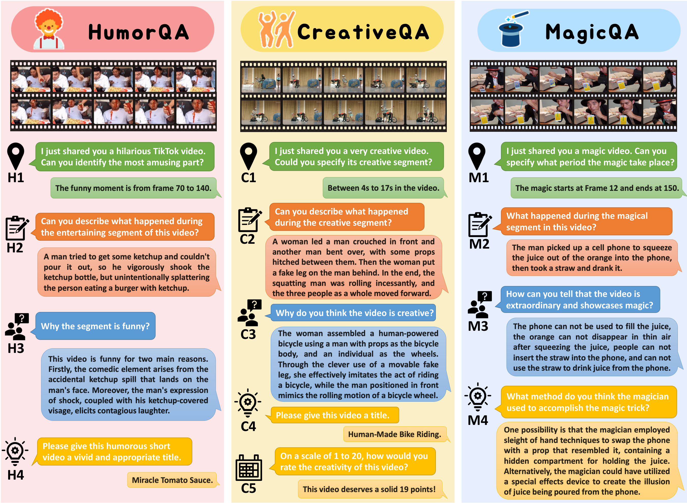

# [FunQA: Towards Surprising Video Comprehension](https://funqa-benchmark.github.io/)


[](https://arxiv.org/abs/2306.05424)
[](https://drive.google.com/drive/folders/1hUjV7z_RDnGwhux663yG8-QD7WyyMnEB?usp=sharing) 
[]()
[]()
</br>
[]()
[]()
[]()

Welcome to FunQA's open source Project Page, FunQA is a Video Question Answering benchmark that aims
at enhancing video reasoning upon counter-intuitive videos, such as humorous
videos, creative videos, and magic videos.

This repository is still under maintenance, and we will update the full FunQA dataset and our model in the future.

<video controls>
  <source src="[https://private-user-images.githubusercontent.com/91806420/247702306-949c3fe2-dd23-46bc-b214-21241f8c7619.mp4?jwt=eyJhbGciOiJIUzI1NiIsInR5cCI6IkpXVCJ9.eyJrZXkiOiJrZXkxIiwiZXhwIjoxNjg3Mzc1MjM4LCJuYmYiOjE2ODczNzQ5MzgsInBhdGgiOiIvOTE4MDY0MjAvMjQ3NzAyMzA2LTk0OWMzZmUyLWRkMjMtNDZiYy1iMjE0LTIxMjQxZjhjNzYxOS5tcDQ_WC1BbXotQWxnb3JpdGhtPUFXUzQtSE1BQy1TSEEyNTYmWC1BbXotQ3JlZGVudGlhbD1BS0lBSVdOSllBWDRDU1ZFSDUzQSUyRjIwMjMwNjIxJTJGdXMtZWFzdC0xJTJGczMlMkZhd3M0X3JlcXVlc3QmWC1BbXotRGF0ZT0yMDIzMDYyMVQxOTE1MzhaJlgtQW16LUV4cGlyZXM9MzAwJlgtQW16LVNpZ25hdHVyZT03OTVlN2M3NzY2NGZkMTNhZWMzYWUxYjAyNjhkNjdlNWM2YWI0YWZmZWQ5OTNmNjdhODk5YThkZDkwMGVmOTM2JlgtQW16LVNpZ25lZEhlYWRlcnM9aG9zdCZhY3Rvcl9pZD0wJmtleV9pZD0wJnJlcG9faWQ9MCJ9.RLLLG0vdkc2cVV7PaSDPWcqXAY0FaBaTgCx-BXmFhQY]()" type="video/mp4">
Your browser does not support the video tag.
</video>

## Todo

1. [x] Release the FunQA dataset.
1. [x] Post the paper: FunQA: Towards Surprising Video Comprehension
2. [ ] Release the FunQA Extended dataset.
3. [ ] Release our full benchmark, comparison results with other LLMs and the new metrics for Free-text task.

## Table of Contents

- [FunQA Benchmark](#funqa-benchmark)
    * [FunQA Dataset Construction and Tasks](#funqa-dataset-construction-and-tasks)
    * [FunQA Extension Dataset](#funqa-extension-dataset)
    * [Dataset Examples](#dataset-examples)
- [Data Preparation](#data-preparation)
- [Acknowledgement](#acknowledgement)
- [License](#license)

## FunQA Benchmark



- FunQA is a pioneering **VideoQA benchmark** specially curated to hone video reasoning capabilities in the
  counter-intuitive context of **humorous**, **creative**, and **magic** videos.
- We create FunQA with the principle of **spatial-temporal**, **visual-centric reasoning**, and **Free-text generation**. Rigorous
  tasks including **positioning**, **describing**, and **reasoning** the counter-intuitive clips are set up.
- FunQA dataset has a total of 4.3k videos, 23.9 hours, and a total of 312k QA pairs with high quality.

### Dataset Construction and Tasks

### Dataset Statics
FunQA contains **4,365** counter-intuitive video clips and **311,950** question-answer pairs, the total
length of these videos is **23.9** hours and the average length of video clips is **19** seconds.
### Extension Dataset

#### FunQA Multi-choice Dataset


#### FunQA Dialog Dataset


### Dataset Examples

## Install

You can create an anaconda environment for this project

```angular2html
conda create -n funqa python==3.8
conda activate videofunqa
git clone https://github.com/Jingkang50/FunQA
```

## Data Preparation

Please download all the videos and annotation files from [here]().

For FunQA Dataset: there are four zip files:

- `funqa_train.zip`, `funqa_val.zip`, `funqa_test.zip`: Videos for training, validation and test.
- `funqa_base_annotation.zip`: Annotation files for FunQA Base Dataset.
  After downloading, please unzip `funqa_train.zip`, `funqa_val.zip` and `funqa_test.zip` to a folder called
  `funqa_base\videos` and unzip `funqa_base_annotation.zip` to a folder called `funqa_base\annotation`.

For FunQA Extension Dataset: Coming soon.

## Acknowledgement

This study is supported by the Ministry of Education, Singapore, under its MOE AcRF Tier 2 (MOE-T2EP20221- 0012), NTU
NAP, and under the RIE2020 Industry Alignment Fund – Industry Collaboration Projects (IAF-ICP) Funding Initiative, as
well as cash and in-kind contribution from the industry partner(s).

If you're using FunQA in your research or applications, please cite using this BibTeX:
```bibtex
    @article{xie2023funqa,
      title={FunQA: Towards Surprising Video Comprehension},
      author={Xie, Binzhu and Zhang, Sicheng and Zhou, Zitang and Li, Bo and Zhang, Yuanhan and Hessel, Jack and Yang, Jingkang and Liu, Ziwei},
      journal={GitHub repository},
      year={2023},
      howpublished = {\url{https://github.com/Jingkang50/FunQA}}
  }
```

## License
<a rel="license" href="http://creativecommons.org/licenses/by-nc-sa/4.0/"></a><br />This work is licensed under a <a rel="license" href="http://creativecommons.org/licenses/by-nc-sa/4.0/">Creative Commons Attribution-NonCommercial-ShareAlike 4.0 International License</a>.


Looking forward to your feedback and please raise any issues or questions [here](https://github.com/Jingkang50/FunQA/issues). 